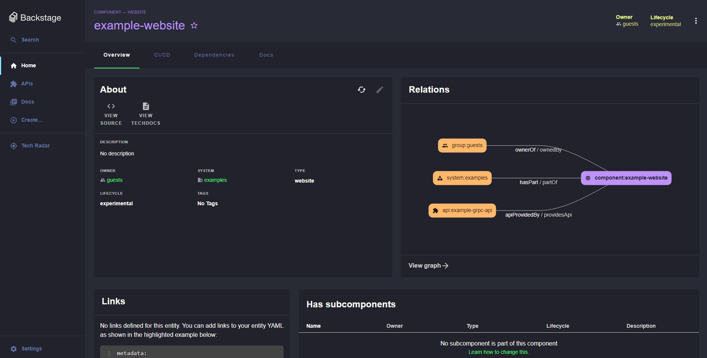

# Dracula theme

Welcome to the Dracula theme !

This plugin brings the beautiful [Dracula](https://www.draculatheme.com) to your Backstage application.



## Setup

Install this plugin:

```shell
# From your Backstage root directory
yarn --cwd packages/app add @fjudith/plugin-dracula-theme
```

## Theme installation

Add the plugin to the `App.tsx`.

```typescript
// In packages/app/src/App.tsx
import { UnifiedThemeProvider, themes } from '@backstage/theme';
import CssBaseline from '@material-ui/core/CssBaseline';
import FlareIcon from '@material-ui/icons/Flare';
import Brightness2Icon from '@material-ui/icons/Brightness2';
import { draculaTheme } from '@fjudith/plugin-dracula-theme';

const app = createApp({
...

  // Note: Fill free to remove the default "light" and "dark" themes or replace the "id: 'dark'" by "id: 'dracula'.
  themes: [
    {
      id: 'dracula',
      title: 'Dracula',
      variant: 'dark',
      icon: <FlareIcon/>,
      Provider: ({ children }) => (
        <UnifiedThemeProvider theme={draculaTheme} noCssBaseline>
          <CssBaseline />
          {children}
        </UnifiedThemeProvider>
      ),
    },
    {
      id: 'light',
      title: 'Light',
      variant: 'light',
      icon: <FlareIcon/>,
      Provider: ({ children }) => (
        <UnifiedThemeProvider theme={themes.light} children={children} />
      ),
    },
    {
      id: 'dark',
      title: 'Dark',
      variant: 'dark',
      icon: <Brightness2Icon />,
      Provider: ({ children }) => (
        <UnifiedThemeProvider theme={themes.dark} children={children} />
      ),
    },
  ],
});
```

## Update logo color

1. Enable customization of the default Backstage logo.

```diff
// In packages/app/src/components/LogoFull.tsx
- const LogoFull = () => {
-   const classes = useStyles();
+ const LogoFull = (props: any | undefined) => {
+   const defaultClasses = useStyles();
+   const classes = {
+     ...defaultClasses,
+     ...props?.classes
+   }
};
```

2. Enable customization of the default Icon.

```diff
// In package/app/src/components/LogoIcon.tsx
- const LogoIcon = () => {
-   const classes = useStyles();
+ const LogoIcon = (props: any | undefined) => {
+   const defaultClasses = useStyles();
+   const classes = {
+     ...defaultClasses,
+     ...props?.classes
+   }
};
```

3. Add conditions to change the sidebar logos depending on the theme.

```diff
// In packages/app/src/components/Root.tsx
...
- import { makeStyles } from '@material-ui/core';
+ import { Theme, makeStyles } from '@material-ui/core';
...
+ import { appThemeApiRef, useApi } from '@backstage/core-plugin-api';
- const useSidebarLogoStyles = makeStyles({
+ const useSidebarLogoStyles = makeStyles<Theme, { themeId: string }>({
...
+  path: props => ({
+    fill: props.ThemeId === 'dracula' ? '#F8F8F2' ; '#7df3e1'
+  }),
});

const SidebarLogo = () => {
- const classes = useSidebarLogoStyles();
+  const themeId = appThemeApi.getActiveThemeId();
+  const classes = useSidebarLogoStyles({ themeId: themeId! });
...
-        {isOpen ? <LogoFull /> : <LogoIcon />}
+        {isOpen ? <LogoFull classes={classes}/> : <LogoIcon classes={classes}/>}
...
};
```
